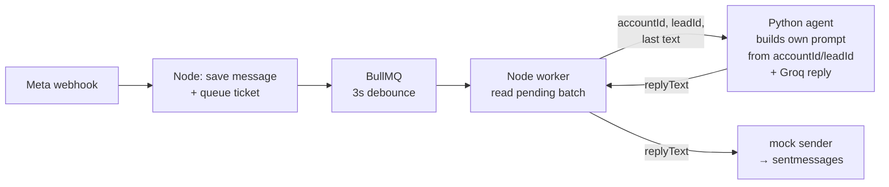

# Multi-Tenant WhatsApp AI Sales Agent


A WhatsApp CRM backend where incoming customer messages are answered by an AI agent — per tenant, in order, without duplicates. Meta-style webhooks land on a fast Node.js API, a BullMQ queue debounces and schedules the work, and a Python (FastAPI + LangGraph) agent builds a tenant-scoped prompt and calls Groq to reply.

**Stack:** Node.js + Express + Mongoose (CommonJS) · MongoDB · Redis + BullMQ · Python FastAPI + LangGraph + Groq · React (Vite) dashboard

| Piece | Port | Process |
|---|---|---|
| Backend API + queue worker | `:4000` | `npm run dev` (worker runs in-process) |
| AI agent | `:8000` | `python run.py` |
| Dashboard (Vite) | `:5173` | `npm run dev` |
| MongoDB / Redis | `:27017` / `:6379` | `docker compose up -d` |

**Contents:** [1. Run it](#1-run-it--step-by-step) · [2. Architecture](#2-architecture) · [3. Message order](#3-how-messages-of-the-same-lead-stay-in-order) · [4. Duplicate prevention](#4-how-duplicate-replies-are-prevented) · [5. Tenant isolation](#5-how-tenants-never-see-each-others-data) · [6. Reliability](#6-reliability) · [7. API reference](#7-api-reference) · [8. Data model](#8-data-model) · [9. Simulation](#9-simulation) · [10. Production plan](#10-production-plan--10000-leads-at-once) · [11. Bonus features](#11-bonus-features-done)

## 🎬 Demo & submission

| Item | Where |
|---|---|
| **Video walkthrough** (~5–6 min: simulation → Test 5 dashboard check → code walkthrough) | [Google Drive](https://drive.google.com/file/d/1p4o9p7a9oTc_7zhTNDlra5hOIufwjcOw/view?usp=sharing) |
| Simulation report (`npm run simulate`) | [`simulation-report.txt`](simulation-report.txt) |
| Dashboard screenshots | [`screenshot/`](screenshot/) |

---

## 1. Run it — step by step

**Prerequisites:** Node.js 20+, Python 3.11+, Docker Desktop.

```bash
# 1) MongoDB + Redis
docker compose up -d

# 2) Backend (:4000)
cd backend
cp .env.example .env        # Windows: copy .env.example .env
npm install
npm run seed                # 2 tenants + owner logins (idempotent)
npm run dev

# 3) AI Agent (:8000) — fresh terminal
cd ai-agents
python -m venv .venv
.venv/Scripts/activate      # Windows
# source .venv/bin/activate # Linux / macOS
pip install -r requirements.txt
cp .env.example .env        # set GROQ_API_KEY (MONGO_URI must match backend)
python run.py

# 4) Dashboard (:5173) — fresh terminal
cd frontend
npm install
npm run dev
```

**Verify everything is up:**

```bash
curl http://localhost:4000/health     # {"status":"ok"}
curl http://localhost:8000/health     # {"ok":true,"model":"openai/gpt-oss-120b"}

cd backend
npm run simulate                      # full 4-test simulation (~1–2 min)
```

### Login credentials (created by `npm run seed`)

| Tenant | Business | Email | Password |
|---|---|---|---|
| `acc_A` | Sunrise Realty | `owner@sunrise.test` | `Sunrise@123` |
| `acc_B` | FitZone Gym | `owner@fitzone.test` | `FitZone@123` |

Every environment variable lives in `backend/.env.example` and `ai-agents/.env.example`.

---

## 2. Architecture

Four steps — that is the whole AI path:



1. **Node webhook** (`POST /webhook/whatsapp`) receives the Meta payload, resolves the tenant from `phone_number_id`, upserts the lead, saves the incoming message to Mongo, and puts **one ticket per lead** on the BullMQ queue (`{accountId, leadId}`, 3-second debounce, dedup key `lead-<leadId>`). It answers Meta with `200` in under 200 ms — no LLM here.

2. **Node worker** picks up the ticket after the debounce, reads this lead's pending messages from Mongo (everything newer than the last reply), and calls the Python agent through `agentClient.js` with exactly three things: **`accountId`, `leadId`, and the last message's text**.

3. **Python agent** uses the `accountId` + `leadId` it received to load its own context from Mongo (that tenant's config: business name, tone, pricing, FAQs + this lead's last 10 messages), builds the prompt itself, calls Groq, and returns the **`replyText`** to Node.

4. **Node** receives the reply text and sends it: it is saved as an outgoing `Message` (`direction:"out"`, `sender:"ai"`, `latencyMs`) so it becomes part of the conversation history and the dashboard, then handed to the sender. The sender is **mock mode** — instead of the real WhatsApp Cloud API it logs the outbound send to `sentmessages` and prints `[MOCK SEND] …`. The text is the AI reply either way; only the transport is mocked.

The dashboard (`:5173`) talks only to the Express API (`/api/*`, JWT) — it never touches the agent or the queue directly.

**Why two processes:** the webhook must answer Meta in under 200 ms — it never calls an LLM. Queueing moves all AI work to the worker, and prompt-building/LLM concerns live in the Python service (the assignment's "AI agent"). The worker runs **in-process with the API** (`server.js` requires `queue/worker`) so `npm run dev` starts everything except the agent.

**Backend layout (`backend/src`):**

| Path | Role |
|---|---|
| `server.js` | Boots Mongo, worker, mounts routes |
| `routes/webhook.routes.js` | Meta payload → tenant → lead → save + enqueue |
| `routes/auth.routes.js` | login / me / logout (bcrypt + JWT + httpOnly cookie) |
| `routes/lead.routes.js` | Dashboard APIs, every query filtered by `accountId` |
| `routes/dev.routes.js` | Test panel → builds Meta payload → own webhook |
| `queue/queue.js` | BullMQ queue, debounce + dedup config |
| `queue/worker.js` | Worker, `WORKER_CONCURRENCY` across leads |
| `queue/processor.js` | Per job: takeover check → batch → agent → save reply |
| `services/replyService.js` | "Which messages still need a reply" + save/send |
| `services/agentClient.js` | HTTP call to Python agent (45 s timeout) |
| `services/whatsappSender.js` | Mock sender → `sentmessages` |
| `middlewares/auth.middleware.js` | JWT → `req.user`, `req.accountId` (token only) |
| `models/*` | Tenant, User, Lead, Message, SentMessage |

---

## 3. How messages of the same lead stay in order

**Method: one debounced, deduplicated ticket per lead + a reply boundary read from the database.**

```js
// webhook — one ticket per lead, trailing 3s debounce
messageQueue.add("handle-message", { accountId, leadId }, {
    delay: 3000,                               // trailing debounce
    deduplication: {
        id: `lead-${leadId}`,                  // same lead → SAME ticket
        replace: true, extend: true,           // new msg resets the 3s timer
        keepLastIfActive: true,                // work in flight → keep one waiting
    },
});
```

```js
// worker — re-reads the pending batch from Mongo when the ticket runs
const batch = await getUnrepliedBatch({ accountId, leadId });
//   lastOut  = newest {direction:"out"} for this lead
//   batch    = {direction:"in", createdAt: { $gt: lastOut.createdAt }}
//              .sort(createdAt).limit(HISTORY_BATCH)   // chronological
```

- **Same lead → sequential.** All rapid messages of one lead merge into a single ticket (`dedup id = lead-<id>`), processed FIFO. The worker always reads the current state from Mongo, never a stale snapshot.
- **Different leads → parallel.** Each lead has its own ticket; `WORKER_CONCURRENCY=10` lets 10 different leads reply at the same time.
- **Why this method:** a trailing debounce naturally batches "Mera naam Rahul hai" … "Price kya hai?" into one combined reply (a bonus requirement), while Mongo's `createdAt` ordering guarantees the batch is fed to the LLM chronologically. It uses a real queue (BullMQ/Redis) — no `setTimeout`, no in-memory array.

---

## 4. How duplicate replies are prevented

Three layers, from cheapest to strongest:

1. **Queue de-duplication** — within the 3-second window, N messages from a lead collapse into 1 job (dedup key `lead-<leadId>`), so there is nothing to double-reply to.
2. **Database uniqueness** — `Message.waMessageId` has a **unique index**. If Meta replays a webhook, the insert throws `E11000` and the handler skips it. This survives process restarts and multiple server instances — it is not an in-memory check:

```js
// webhook.routes.js — the unique index IS the duplicate check
try {
    await Message.collection.insertOne({ ..., waMessageId, direction: "in" });
} catch (err) {
    if (err.code === 11000) return console.log(`[WEBHOOK] Duplicate ${waMessageId} skipped`);
    throw err;
}
```

3. **Reply boundary** — the worker only replies to inbound messages **newer than the newest outbound message** (`createdAt > lastOut.createdAt`). A message that was already answered can never enter a later batch, so one inbound message produces at most one reply.

---

## 5. How tenants never see each other's data

**Webhook (AI side):** the tenant is resolved **only** from `metadata.phone_number_id` — never from the message text, URL, or request body.

```js
const tenant = await Tenant.findOne({ phoneNumberId: change?.metadata?.phone_number_id });
if (!tenant) return res.sendStatus(200);         // unknown tenant → log + ignore
```

**Dashboard (API side):** `req.accountId` is set **only from the verified JWT** by the auth middleware, and every query is filtered by it:

```js
// middleware — accountId comes from the token, nothing else
req.user = jwt.verify(token, JWT_SECRET);
req.accountId = req.user.accountId;

// every dashboard query
const leads = await Lead.find({ accountId: req.accountId });
```

**Cross-tenant ids are invisible:** requesting another tenant's `leadId` returns `404 Not Found` (not 403), so the other tenant's lead does not even appear to exist.

**In the AI prompt:** the agent loads the config for the lead's `accountId` only, and the system prompt's rule 2 forbids quoting any other business's data. Tenant A's lead asking for Tenant B's prices gets a polite refusal.

**Proof:** `npm run simulate` Test 4 (tenant isolation) passes, and the API test suite returns 401/404 for every cross-tenant path.

---

## 6. Reliability

| Concern | Implementation |
|---|---|
| LLM timeout | `LLM_TIMEOUT_MS=20000` (agent side); worker→agent HTTP aborts at `AGENT_TIMEOUT_MS=45000` |
| Retry | ChatGroq `max_retries=3` with exponential backoff; job-level `attempts: 3, backoff: 2s` |
| Fallback | If every attempt fails, the worker saves the polite fallback text with `sender: "fallback"` and logs the error — the lead still gets a reply |
| Webhook errors | Always answers Meta with `200` so Meta never marks the endpoint down |

The agent additionally degrades through a structured-output ladder (`json_schema → json_mode → off`) so a format failure alone does not lose the reply.

---

## 7. API reference

All routes except login require `Authorization: Bearer <jwt>` (or the httpOnly `token` cookie).

| Method | Route | Purpose |
|---|---|---|
| `POST` | `/webhook/whatsapp` | Meta webhook (public — Meta has no JWT) |
| `POST` | `/api/auth/login` | Email + password → JWT (httpOnly cookie + body) |
| `GET` | `/api/auth/me` | Current user + tenant business name |
| `POST` | `/api/auth/logout` | Clear cookie |
| `GET` | `/api/stats` | Dashboard stat cards |
| `GET` | `/api/leads` | My tenant's leads, newest first (last message included) |
| `GET` | `/api/leads/:leadId/messages` | Full chat, oldest first (other tenant → 404) |
| `PATCH` | `/api/leads/:leadId/takeover` | `{enabled:true/false}` — AI off/on for one lead |
| `POST` | `/api/leads/:leadId/reply` | Owner sends a human reply (`sender:"human"`) |
| `POST` | `/api/dev/simulate-message` | Test panel → builds Meta payload → **own webhook** (404 when `NODE_ENV=production`) |

---

## 8. Data model

Database: **`whatsapp_ai`** — 5 collections (every collection except `tenants` stores `accountId`).

| Collection | Purpose | Key fields |
|---|---|---|
| `tenants` | Business config used in prompts | `accountId`, `businessName`, `phoneNumberId`, `tone`, `pricing`, `faqs[]` |
| `users` | Dashboard logins | `email` (unique), `passwordHash` (bcrypt), `accountId` |
| `leads` | Customers | `phone` + `accountId` (unique together), `status`, `humanTakeover`, `lastMessageAt` |
| `messages` | The conversation (in + out) | `waMessageId` **unique index**, `direction`, `sender`, `latencyMs`, `createdAt` |
| `sentmessages` | Audit log of outbound sends | `to`, `text`, `replyToMessageId`, `sentAt` |

Indexes: `messages.waMessageId` (unique — duplicates), `messages.(accountId, leadId, createdAt)` (batch/history reads), `leads.(accountId, phone)` (upsert path).

---

## 9. Simulation

```bash
cd backend
npm run simulate
```

Four tests, report saved in [`simulation-report.txt`](simulation-report.txt):

| Test | What it proves | Result |
|---|---|---|
| 1 — Concurrency | 20 leads at once: webhook `<200 ms`, all 20 replied | PASS (max webhook 156 ms, 20/20) |
| 2 — Duplicate | Same message sent 3× → exactly 1 reply, 1 saved doc | PASS |
| 3 — Order + memory | "Mera naam Amit hai" later → reply remembers the name | PASS |
| 4 — Tenant isolation | Tenant A's data never appears in Tenant B's replies | PASS |

Dashboard screenshots: [`screenshot/`](screenshot/) — login, leads + chat, AI OFF state.

---

## 10. Production plan — 10,000 leads at once

- **Queue:** managed Redis (e.g. ElastiCache), workers scaled horizontally with `WORKER_CONCURRENCY` matched to the LLM rate limit, and per-tenant fair queues so one tenant's burst cannot starve the others.
- **Mongo:** replica set for failover, TTL/archive of old messages, and sharding by `accountId` if volume grows.
- **Webhook:** stateless instances behind a load balancer, plus HMAC verification of `X-Hub-Signature-256`.
- **LLM:** per-tenant rate limits and token/cost accounting, streaming for lower perceived latency, and a fallback provider.
- **Frontend:** Socket.IO rooms per `accountId` instead of 3 s polling (tenant-scoped events only).
- **Observability:** p95 reply-time metrics, a dead-letter queue for permanently failed jobs, and alerts on fallback-rate spikes.

---

## 11. Bonus features (done)

From the assignment's bonus list:

| Bonus | How it works here |
|---|---|
| **Debounce** | 3-second trailing debounce + dedup key `lead-<leadId>`: a lead sending 3 messages within 3 s gets **one combined reply** instead of 3 (see §3) |
| **Stats cards** | `GET /api/stats` powers the dashboard header: total leads, AI replies today, average reply time, fallback count |
| **Human reply from dashboard** | With AI OFF for a lead, the owner types a reply in the chat window — saved as `sender:"human"` and written through the mock sender |
| **Unread badge** | WhatsApp-style green counter on each lead: `unreadCount` = customer messages newer than `lastOpenedAt`; opening the chat marks it read (instantly on click, confirmed on next 3 s poll) |

Dashboard proof: [`screenshot/`](screenshot/) shows stat cards, AI toggle, and human replies tagged `HUMAN` in the chat.


